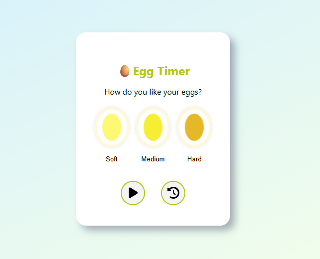

# 🥚 Egg Timer

**How do you like your eggs?** Soft, medium, or hard-boiled? This adorable Egg Timer web app lets you choose how you like your eggs and helps you boil them to perfection with a cute UI and audio alerts! 🎵

## 

## 🌟 Features

- 🥚 Choose from Soft, Medium, or Hard boiled eggs
- ⏱️ Beautiful countdown timer with animated effects
- 🔊 Alarm sound when your egg is ready
- 🎨 Lovely, minimal and cute UI
- 🎮 Start/Pause and Reset controls
- 🔒 Button locking when timer is active to prevent mishits

---

## 📂 Project Structure

egg-timer/
├── index.html # Main HTML file
├── styles.css # CSS styling
├── script.js # JavaScript logic
├── images/ # Egg and control icons
│ ├── soft_boiled_egg.png
│ ├── medium_boiled_egg.png
│ ├── hard_boiled_egg.png
│ ├── play-solid.svg
│ ├── pause-solid.svg
│ └── clock-rotate-left-solid.svg
└── sounds/
├── alarm.wav
└── click.wav

---

### 🛠️ Tech Used

HTML5 — Structure of the app

CSS3 — Styling and layout

JavaScript (Vanilla) — Logic for the timer and user interactions

Audio + Icons — For enhanced interactivity and cuteness 🐣

---

### 🚀 How to Run the App

1. **Clone the repository**:

   ```bash
   git clone https://github.com/Stephanie-ib/Egg-Timer.git

   ```

2. Open index.html in your browser

3. Click, Boil, and Enjoy! 🍳

🙌 Acknowledgements
Icons are from Font Awesome.

Egg images were custom-designed on Figma.

Sound effects from FreeSound.

💡 Future Ideas
Add a progress bar ⏳

Add dark mode 🌙

Mobile push notifications 📱

📬 Feedback & Contributions
Have a suggestion or found a bug?
Feel free to open an issue or submit a pull request! 🧑‍💻

📜 License
MIT License — feel free to use, share, and modify!
